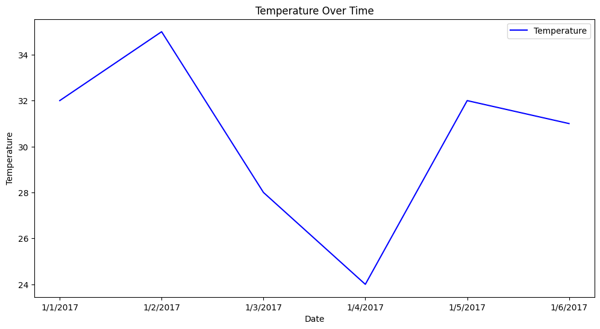
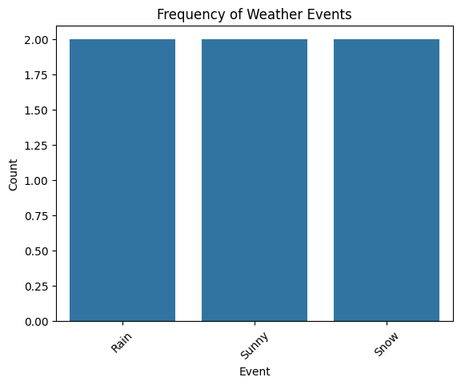

Weather Data Analysis

This project analyzes weather data to uncover trends and patterns in temperature, humidity, and weather events. The focus is on data cleaning, exploration, and visualization.


Objective
The objective of this project is to analyze weather data to:
- Clean and preprocess raw weather data for accurate insights.
- Identify extreme weather conditions (e.g., highest and lowest temperatures).
- Explore the frequency of various weather events (e.g., Rain, Sunny, Snow).
- Visualize temperature trends over time and the distribution of weather events.

Key Insights
- The highest temperature was 35 on 1/2/2017, event : Sunny .
- The lowest temperature was 24 on 1/4/2017, event : Snow.
- The Occurance of the event were equal.

Tools Used
- Python
- Pandas
- Matplotlib
- Seaborn
- Jupyter Notebook

Visualizations
1. Temperature Trends Over Time:
   
2. Frequency of Weather Events:
   

How to Run the Project
1. Clone the repository:
   ```bash
   git clone https://github.com/your-username/weather-analysis.git
   

Next Steps:

I’m planning to:
🔗 Combine this dataset with other data (e.g., automobile sales or pollution) to uncover deeper insights.

📈 Build an interactive dashboard for real-time weather analysis.
